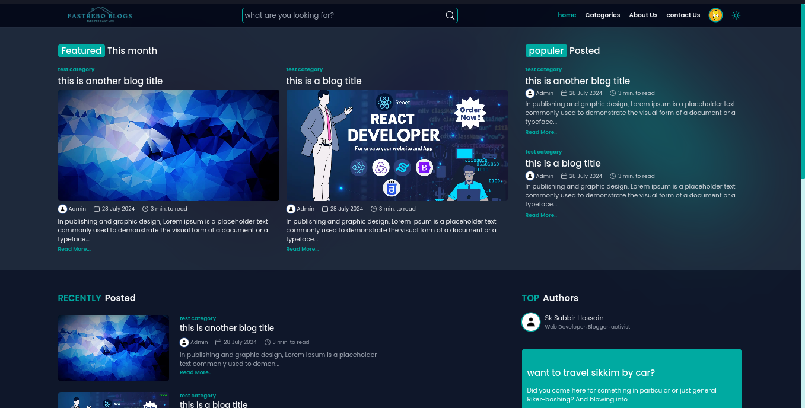

# Daily Blogs

Welcome to **Daily Blogs**! This is an open-source blog platform built with Next.js 14, allowing users to search for and comment on blogs. Whether you're a developer looking to contribute or a curious user, this README will guide you through the essential details of the project.



## Table of Contents

- [Daily Blogs](#daily-blogs)
  - [Table of Contents](#table-of-contents)
  - [Features](#features)
  - [Technologies Used](#technologies-used)
  - [Installation](#installation)
    - [1. Clone this repository to your local machine using Git.](#1-clone-this-repository-to-your-local-machine-using-git)
    - [2. Change to the project directory.](#2-change-to-the-project-directory)
    - [3. Install dependencies. (recommended to use yarn)](#3-install-dependencies-recommended-to-use-yarn)
    - [4. Set up environment variables](#4-set-up-environment-variables)
    - [5. Start the development server using this command:](#5-start-the-development-server-using-this-command)
    - [Usage](#usage)
  - [Contributing](#contributing)
  - [License](#license)
    - [Summary of Terms:](#summary-of-terms)
  - [Code of Conduct](#code-of-conduct)
  - [Contact](#contact)

## Features

My Daily Blogs website includes the following features:

- **Create an Account**: Users can create an account with full role-based authentication to interact with the platform.
- **Email Verification**: Uses SMTP services to verify email addresses during account creation.
- **Password Recovery**: Allows users to recover their passwords if they forget them.
- **Search Blogs**: Easily find blogs by searching for specific keywords.
- **Comment on Blogs**: Engage with the content by leaving comments on blogs.
- **Dark Mode**: Provides a dark mode option for improved readability in low-light environments.
- **Open Source**: The project is open to contributions from anyone interested.

## Technologies Used

- **Next.js 14:** A React framework for building server-rendered or statically-exported React applications.
- **Authentication**: Utilizes `next-auth` version 4.24.5 for authentication.
- **React:** A popular JavaScript library for building user interfaces.
- **Tailwind CSS:** A utility-first CSS framework for styling the user interface.
- **Node.js**: JavaScript runtime used for building the REST API.
- **MongoDB**: Database for storing user accounts and blog data.

## Installation

To get started with Daily Blogs, follow these steps:

#### 1. Clone this repository to your local machine using Git.

```bash
git clone https://github.com/sksabbirhossain/daily-blogs.git
```

#### 2. Change to the project directory.

```bash
cd daily-blogs
```

#### 3. Install dependencies. (recommended to use yarn)

```bash
yarn install
```

#### 4. Set up environment variables

Create a .env file in the root directory of the project. You can use the .env.example file as a template. Copy the example file and rename it to .env

```bash
cp .env.example .env
```

#### 5. Start the development server using this command:

```bash
yarn run dev
```

Access the application in your web browser at [http://localhost:3000](http://localhost:3000).

### Usage

- Visit the deployed website or run the development server (as described in the installation instructions) to access the application.
- Search for blogs by keywords to find specific content.
- Leave comments on blogs to share your thoughts and engage with other users.

## Contributing

If you have any suggestions on how to improve this website, please open an issue, share your ideas, and create a pull request. Or read this [CONTRIBUTING](CONTRIBUTING.md) file.

## License

This project is licensed under the terms outlined in the [LICENSE.md](LICENSE.md) file.

### Summary of Terms:

- **Viewing and Studying**: You are free to view, study, and learn from the source code and documentation.
- **Contributing**: Contributions to this project are welcome. Please adhere to the contribution guidelines provided in the [CONTRIBUTING.md](CONTRIBUTING.md) file.
- **Restrictions**:
  - **Personal Use**: This project cannot be used for personal purposes outside the scope of this open-source project.
  - **Commercial Use**: You are not allowed to sell, distribute, or incorporate any part of this project into other commercial products or services.

**Violation of License Terms**: If any part of this project is copied, used, or distributed in violation of these terms, legal action may be taken to enforce these license terms.

By using this project, you agree to abide by these terms. For more details, please refer to the full [LICENSE.md](LICENSE.md) file.

## Code of Conduct

We adhere to the Contributor Covenant Code of Conduct to ensure a positive and inclusive environment for all participants in our community. Please review the full [Code of Conduct](CODE_OF_CONDUCT.md) for details on our standards and enforcement guidelines.

For more details, visit the [Code of Conduct](CODE_OF_CONDUCT.md) file.

## Contact

For any questions, feedback, or inquiries, you can reach out through the following:

- **GitHub Issues**: [Submit an issue](https://github.com/sksabbirhossain/daily-blogs/issues)
- **GitHub Profile**: [sksabbirhossain](https://github.com/sksabbirhossain)
- **Linkedin Profile**: [sk-sabbir-hossain](https://www.linkedin.com/in/sk-sabbir-hossain/)
- **Facebook Profile**: [sksabbirhossain4](https://www.facebook.com/sksabbirhossain4)

Feel free to contact me if you have any questions or if you would like to contribute to the project!

Enjoy using Daily Blogs! If you have any questions or encounter any issues, please create an issue or contact me.
